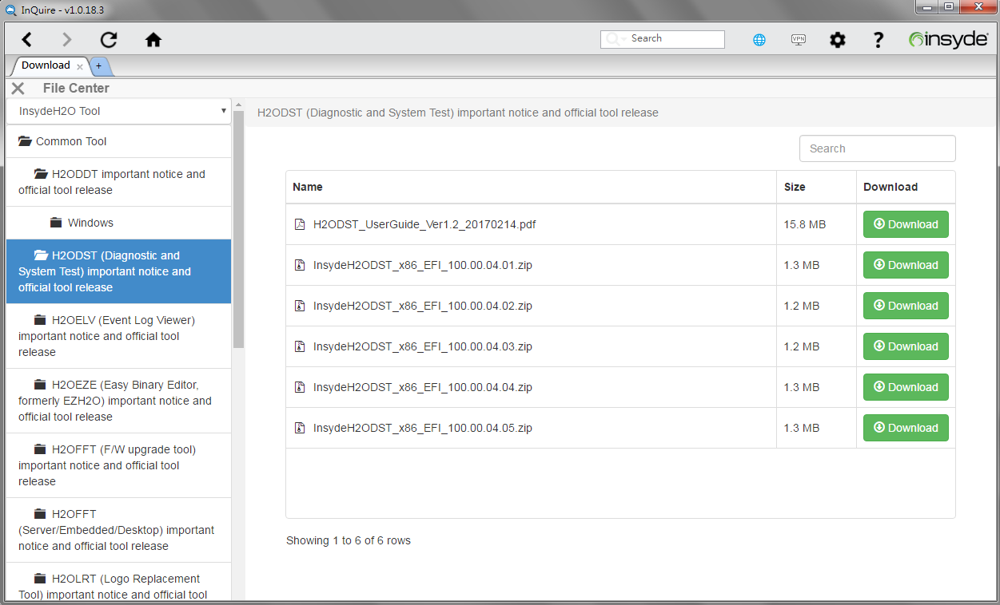
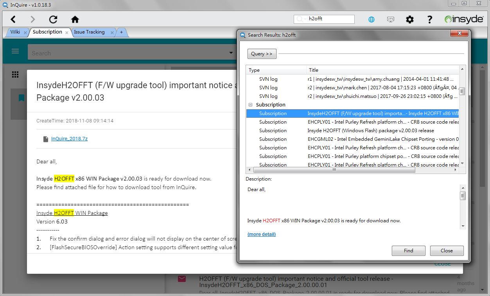

# Untitled

**InQuire® User Guide**

Revision 0.9

2019/11/20

Copyright \(c\) 2019, All Rights Reserved. Insyde Software Corp.

No part of this publication may be reproduced, transmitted, transcribed, stored in a retrieval system, or translated into any language or computer language, in any form, or by any means, electronic, mechanical, magnetic, optical, chemical, manual or otherwise, without the prior written permission of Insyde Software Corp.

Disclaimer

Insyde Software Corp. provides this document and the programs "as is" without warranty of any kind, either expressed or implied, including, but not limited to, the implied warranties of merchantability or fitness for a particular purpose.

This document could contain technical inaccuracies or typographical errors. Changes are periodically made to the information herein; these changes will be incorporated in future revisions of this document. Insyde Software Corp. is under no obligation to notify any person of the changes.

The following trademarks are used in this document:

Insyde and InsydeH2O are registered trademarks or trademarks of Insyde Software Corp. All other trademarks or trade names are property of their respective holders.

Contents

[1 Introduction 5]()

[1.1 Overview 5]()

[2 Getting Started with InQuire 6]()

[2.1 Requirement for InQuire tool 8]()

[2.2 E-MAIL verification before account setting 8]()

[2.3 Account information for InQuire 10]()

[2.4 Home Page 11]()

[2.5 Subscription 12]()

[2.6 Access Right 13]()

[2.7 CODE 14]()

[2.8 Issue Tracking 15]()

[2.9 Training 16]()

[2.10 Download 17]()

[2.11 Super Search 18]()

[2.12 Notification 19]()

[3 Live Update 20]()

[4 Trouble shooting 22]()

Revision History

<table>
  <thead>
    <tr>
      <th style="text-align:left">Revision
         Number</th>
      <th style="text-align:left">Description</th>
      <th style="text-align:left">Author</th>
      <th style="text-align:left">Release
         Date</th>
    </tr>
  </thead>
  <tbody>
    <tr>
      <td style="text-align:left">&lt;0.1&gt;</td>
      <td style="text-align:left">Initial release.</td>
      <td style="text-align:left">David Yu</td>
      <td style="text-align:left">3, 2016</td>
    </tr>
    <tr>
      <td style="text-align:left">&lt;0.2&gt;</td>
      <td style="text-align:left">Add more information for new function support</td>
      <td style="text-align:left">David Yu</td>
      <td style="text-align:left">6, 2016</td>
    </tr>
    <tr>
      <td style="text-align:left">&lt;0.3&gt;</td>
      <td style="text-align:left">Revise and add information</td>
      <td style="text-align:left">David Yu</td>
      <td style="text-align:left">7, 2016</td>
    </tr>
    <tr>
      <td style="text-align:left">&lt;0.4&gt;</td>
      <td style="text-align:left">Revise and add information</td>
      <td style="text-align:left">David Yu</td>
      <td style="text-align:left">8, 2016</td>
    </tr>
    <tr>
      <td style="text-align:left">&lt;0.5&gt;</td>
      <td style="text-align:left">
        
Revise and add information

        
1. File center

        
2.Super search

        
3. Message center

      </td>
      <td style="text-align:left">David Yu</td>
      <td style="text-align:left">12, 2016</td>
    </tr>
    <tr>
      <td style="text-align:left">&lt;0.6&gt;</td>
      <td style="text-align:left">Revise and change function name</td>
      <td style="text-align:left">David Yu</td>
      <td style="text-align:left">3, 2017</td>
    </tr>
    <tr>
      <td style="text-align:left">&lt;0.7&gt;</td>
      <td style="text-align:left">Revise and UI change</td>
      <td style="text-align:left">David Yu</td>
      <td style="text-align:left">11, 2018</td>
    </tr>
    <tr>
      <td style="text-align:left">&lt;0.8&gt;</td>
      <td style="text-align:left">
        
1. The setting is changed since one password support.

        
2. Add confidential sign in document.

      </td>
      <td style="text-align:left">David Yu</td>
      <td style="text-align:left">3, 2019</td>
    </tr>
    <tr>
      <td style="text-align:left">&lt;0.9&gt;</td>
      <td style="text-align:left">
        
Revise and add information

        
1. Add Access right function

        
2. Trouble shooting updated

        
3. Function description updated

      </td>
      <td style="text-align:left">David Yu</td>
      <td style="text-align:left">11, 2019</td>
    </tr>
  </tbody>
</table>## Introduction

 InQuire is a program that provides easy, centralized access to all of Insyde Software's online cloud services.  

### Overview

 This document will provide an overview of using InQuire as well as describe the services you can access from it.

**InQuire Benefits**

* Convenience – integrate Insyde software services into one utility.
* Faster Logins – Use only one login for all service functions.
* Enhancing service efficiency can help improve the overall development experience.

## Getting Started with InQuire

When you have completed the InQuire installation process through the InQuire installer package, the program should successfully launch for the first time. You will be greeted by InQuire's home page, which will show the following tabs at the top that provide quick access to our services system:

**Subscription**: Retrieve information from subscribed publications through this service \(Web Version\).

**Access Right**: It shows list/exports a file what subscribed publications are available.

**CODE**: Review authorized of source code repository.

**Issue Tracking:** Report issues to Insyde and track it via ITS.

**Training:** Training On Demand. Learn from training videos provided by Insyde Software.

**Download:** Download available tool package and document.

**Super Search:** Assist to search out related information in Subscription and Issue Tracking via key word.

**Notification:** Notice newest publication message.

1. Following are buttons for back, Next, Reload and Home.

2. Following are icons that indicates InQuire service and SSL-VPN connecting status.

Note: You have to connect to VPN before access these system services. InQuire will auto-detect and pop prompt as following and ask you connect to VPN. Please make “Yes” and these services are available till the icon of InQuier and VPN is light up.

3. Following is a setting button for each service system account setting.

4. Following is user guide button.

### Requirement for InQuire Tool

* Have current account and password for enter each system.
* PC Environment: Microsoft Windows 7 and later are supported.

### E-MAIL Verification Before Account Setting

First installation : before account setting, you would see following setting page and have e-mail verification. Please follow step to finish the email verification process.

* Step 1: Enter email address and password. The password is used to enter InQuire, you can set any password you want.
* Step 2: Click on “Send Code” button, then we can see following dialog/browser to info us InQuire service has sent send an activated code to your email account.

* Step 3: Check your email account, there is mail with activated code from InQuire server. As following an email sample, we can see an activated code is 098422.

* Step 4: Finally, please fill the activate code 098422 and click on “Active” button to finish the process. Then, we can continue to set service account via next section.

### Account Information for InQuire

After setup has finished via the installer and before executing the first launch of the tool, InQuire will request the account information for all supported Insyde services. To continue, please provide a master password for InQuire \(which is required to open and use InQuire securely\) and fill in account information \(SSL-VPN\) to access Insyde services via InQuire.

The following account settings are requested for each service function.

* **Master password**:
  * Please input your e-mail.
  * The master password is used to enter InQuire, please set a master password you want.
* **SSL-VPN**: Used when logging into VPN to connect Insyde’s services.
* **Training:** The source of the training video. Global as default for non-China region, please provide your company e-mail to Insyde Sales for service application.

### Home Page

The following is the main page of InQuire that shows available function service you can use when you click on the home button.

### Subscription

Subscription is publication service page that can retrieve information from subscribed publications through this service. In order to easy query information, there are related nodes of classifying information in tree view on left side. When you click one of nodes in the tree view you would like to query, it will present related information on a publication list.

Note: Please contact with Insyde account Sales for Insyde publication subscription.

### Access Right

Access right is a list which show what subscribed publications are available for you. You can export the list and confirm with Insyde account Sales if there are all channels here.

### CODE

CODE is a source code repository list page that allows authorized review of each source code repository.

### Issue Tracking

The Issue Tracking service page can report issues to Insyde Software and help track it.

### Training

Training \(Training on Demand\) service provides online developer training courses from Insyde Software. Select from available training subject via playlists and play them from InQuire.

### Download

Download service provides online to download related tool package or document from Insyde Software. Select from available package or document via classified list and download from download service to local disk.

Note: Please contact with Insyde account Sales for Insyde tools application.

### Super Search

Super search can assist to search out related information in Subscription and Issue Tracking via key word.

### Notification

Notification will automatically pop on corner of right bottom and notice how many newest publications message are available. To click detail button on message dialog will redirect to Subscription service page for detail description.

## Live Update

Insyde Live Update is used to automatically make sure that all InQuire utilities are up-to-date via the

Internet. When a new version is available, users will get an update notice from Insyde Live Update icon that will be visible from the Windows task bar.

You can also manually use the right mouse button on the Insyde Live Update icon and hit “Update Now” to perform the update process.

When there are available updates, the latest version of InQuire and other related Insyde tools will be listed in Insyde Live Update Window. Select which tools you would like to update and then start the update process by pressing the "Update" button.

## Trouble Shooting

**1. Why cannot receive mail with activate code?**

Please check if there is anti-virus protection software or firewall \(proxy\) to block, and also check if the mail classify as spam.

**2. Why there is a ”Pulse Secure” logo to display during VPN connection?**

When InQuire connects to VPN via client tool program “Pulse Secure”, it will display its splash screen and reside in tray bar.

**3. There may be following dialogs to ask VPN connection. How to apply?**

Please click “Cancel” button to ignore them.

When InQuire requests VPN connection, it will ask and automatically connect to VPN by itself as following:

**4. How to verify if Training function is available?**

1. If Training function is available, show the training home page.

1. If Training function is **not** available, show the below guideline to get access right of Training function.

If you see this page, it means that InQuire is not able to connect to Training service, please check you have done following steps.

**Step 1.** Ensure VPN is connected.

**Step 2.** Contact Insyde Sales and provide company email to apply authorization of Training.

**Step 3.** Once your e-mail authorized, all the training courses should be listed on the left and available for training. If you still can’t get training course from InQuire, please contact Sales for troubleshooting.

