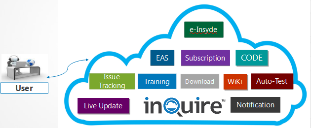
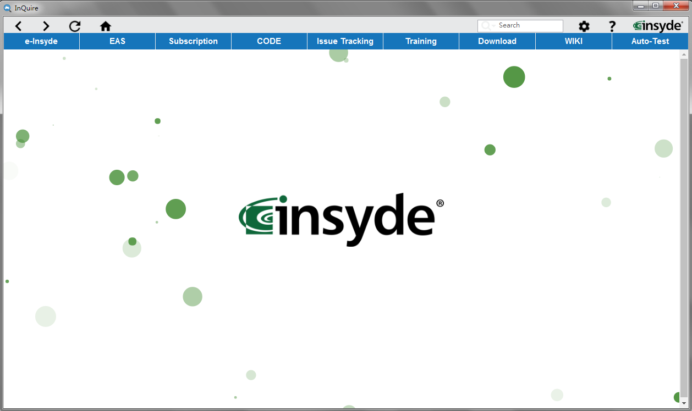
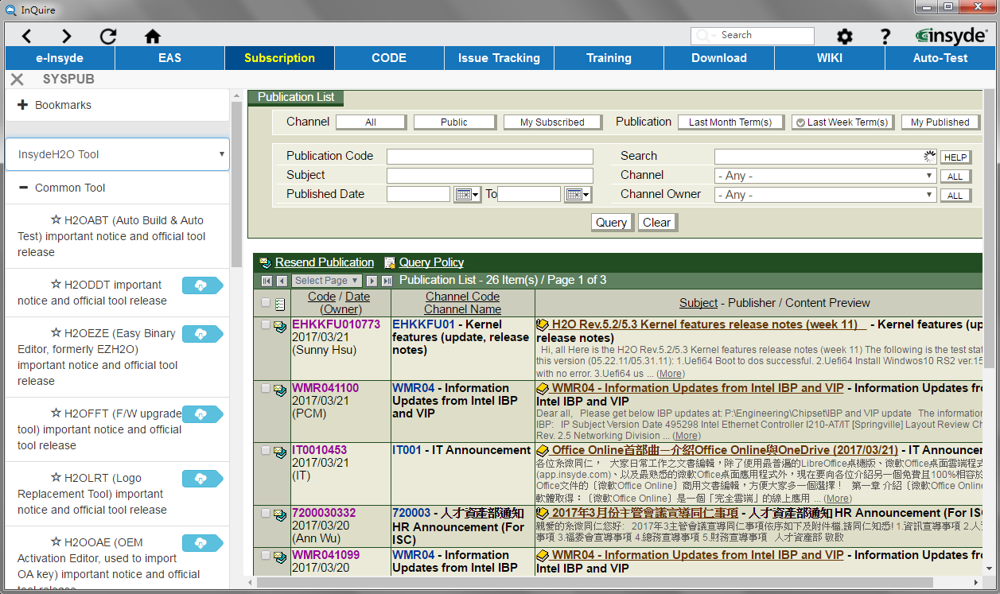
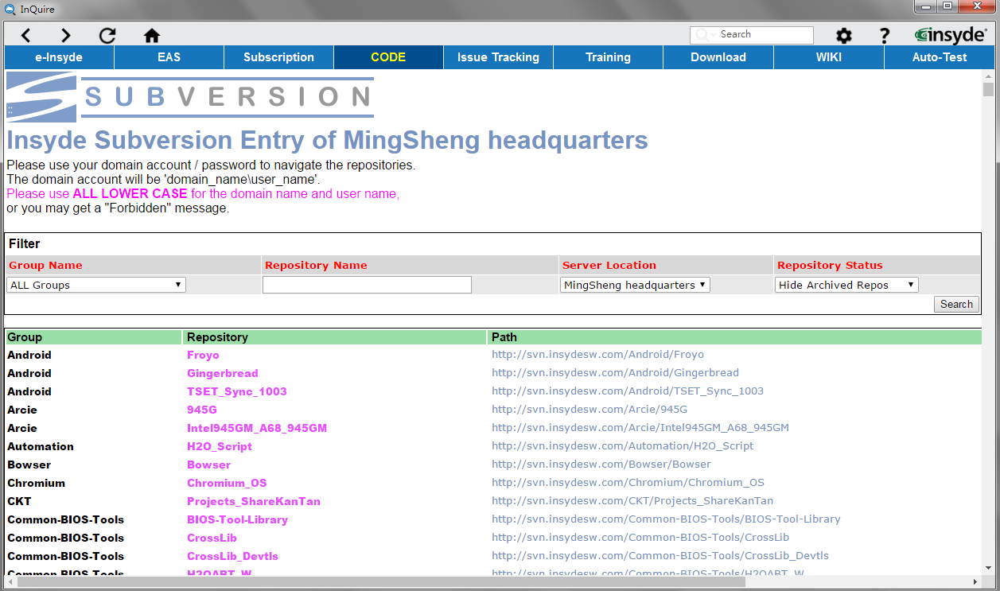
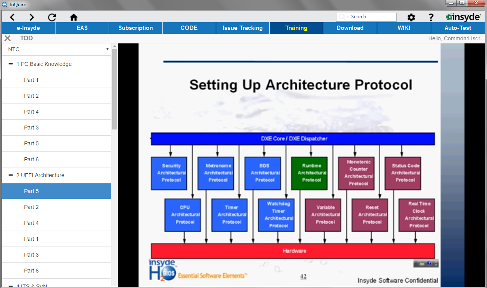
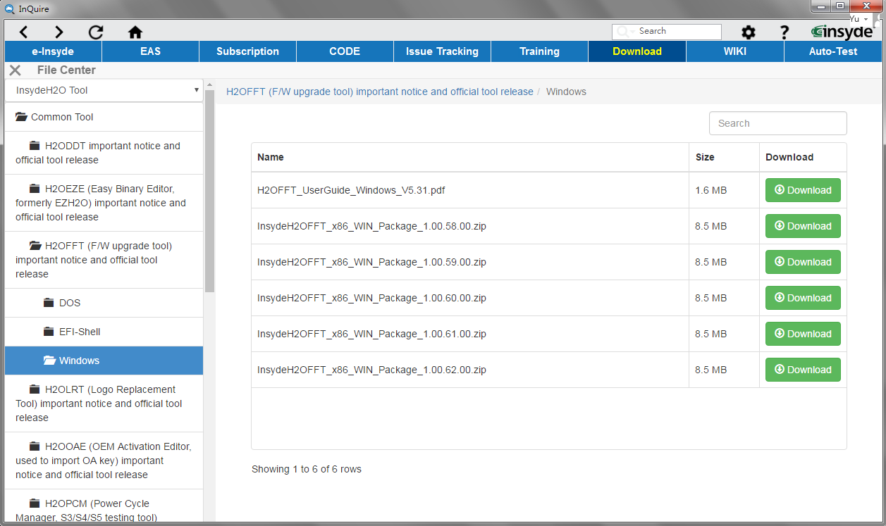
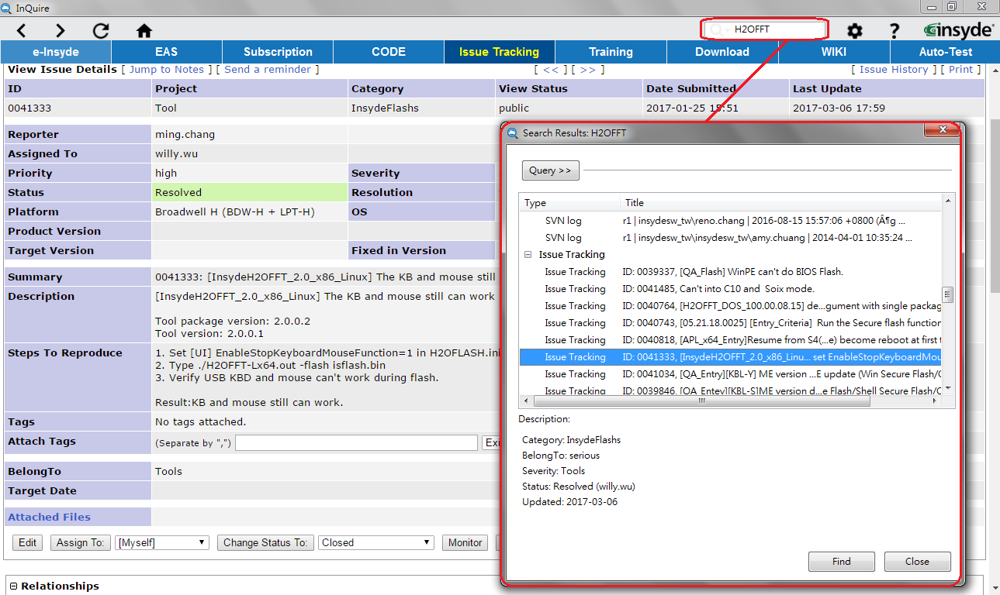
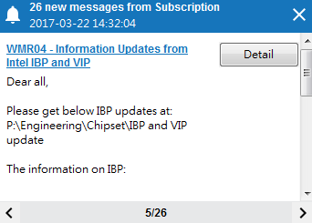
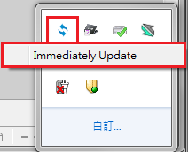
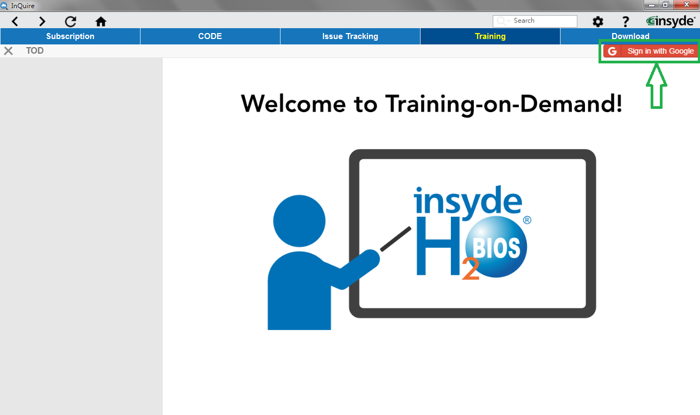

# Internal

**InQuire^®^**

**User Guide**

**Rev. &lt;0.6&gt; Approved**

**Prepared by David Yu**

**&lt;03/30/2017&gt;**

**Insyde Software Corp.**

Copyright \(c\) 1998-2017, All Rights Reserved.

Insyde Software Corp.

No part of this publication may be reproduced, transmitted, transcribed, stored in a retrieval system, or translated into any language or computer language, in any form, or by any means, electronic, mechanical, magnetic, optical, chemical, manual or otherwise, without the prior written permission of Insyde Software Corp.

_**Disclaimer**_

Insyde Software Corp. provides this document and the programs "as is" without warranty of any kind, either expressed or implied, including, but not limited to, the implied warranties of merchantability or fitness for a particular purpose.

This document could contain technical inaccuracies or typographical errors. Changes are periodically made to the information herein; these changes will be incorporated in future revisions of this document. Insyde Software Corp. is under no obligation to notify any person of the changes.

The following trademarks are used in this document:

{width="0.8854166666666666in" height="0.2708333333333333in"} is a registered trademark of Insyde Software Corp.

All other trademarks or trade names are property of their respective holders.

**Revision History**

**Rev.** **Date** **Author** **Approver** **Summary**

0.1 &lt;03/22/2016&gt; David Yu Initial Version

0.2 &lt;06/17/2016&gt; David Yu Add more information for new function support

0.3 &lt;07/06/2016&gt; David Yu Revise and add information

0.4 &lt;08/30/2016&gt; David Yu Revise and add information

0.5 &lt;12/24/2016&gt; David Yu Revise and add information

```text
                                                          1.File center 2. Super search 3. Message center
```

0.6 &lt;03/30/2017&gt; David Yu Revise and change function name

**Table of Contents**

[_1._ _Introduction_ 1](internal.md#introduction)

[_1.1_ _Overview_ 1](internal.md#overview)

[_1.2 Reference_ 2](internal.md#reference)

[_1.2.1_ _Definitions, Glossaries, Acronyms, Abbreviations_ 2](internal.md#definitions-glossaries-acronyms-abbreviations)

[_1.2.2 Reference Documentation_ 2](internal.md#reference-documentation)

[_2._ _Getting Started with InQuire_ 3](internal.md#getting-started-with-inquire)

[_2.1 Requirements for the InQuire Utility_ 4](internal.md#requirements-for-the-inquire-utility)

[_2.2 Account information for InQuire_ 4](internal.md#account-information-for-inquire)

[_2.3 Home page_ 5](internal.md#home-page)

[_2.4 Subscription_ 6](internal.md#subscription)

[_2.5 CODE_ 7](internal.md#code)

[_2.6 Issue Tracking_ 8](internal.md#issue-tracking)

[_2.7 Training_ 9](internal.md#training)

[_2.8 Download_ 10](internal.md#download)

[_2.9 Super search_ 11](internal.md#super-search)

[_2.10 Notifications_ 12](internal.md#notifications)

[_2.11 Auto-Test \(for Insyde Software employees only\)_ 13](internal.md#auto-test-for-insyde-software-employees-only)

[_2.12 e-Insyde system \(for Insyde Software employees only\)_ 14](internal.md#e-insyde-system-for-insyde-software-employees-only)

[_2.13 EAS system \(for Insyde Software employees only\)_ 15](internal.md#eas-system-for-insyde-software-employees-only)

[_2.14 WiKi system \(for Insyde Software employees only\)_ 16](internal.md#wiki-system-for-insyde-software-employees-only)

[_3. Live update_ 17](internal.md#live-update)

[_4. Troubleshooting_ 18](internal.md#troubleshooting)

## Introduction

> The InQuire utility provides easy, centralized access to all of Insyde Software's online cloud services.

### Overview

> This document provides an overview for using InQuire and the services you can access from it.

{width="6.5625in" height="2.7083333333333335in"}

**InQuire benefits:**

* Convenience – integrate all Insyde software services into one utility.
* Faster logins – use a single login for all service functions.
* Enhancing service efficiency can help improve the overall development experience.

### 1.2 Reference <a id="reference .ListParagraph"></a>

The following publications and sources of information may be useful to you.

#### Definitions, Glossaries, Acronyms, Abbreviations

**Term** **Description** **H2OABT** H2O **A**uto-**B**uild-**T**esting **S**ystem **H2ORVS** H2O **R**emote **V**alidation **S**ystem **WTS** **W**orldwide **T**racking **S**ystem **ITS** **I**ssue **T**racking **S**ystem **EAS** **E**nterprise **A**ccess **S**ystem **SVN** Subversion for source version control system **TOD** Training on Demand **CRB** **C**ustomer **R**eference **B**oard

#### 1.2.2 Reference Documentation <a id="reference-documentation .ListParagraph"></a>

**Title** **Rev.** **Date** **Notes** H2OABT User Guide 0.51 2016/02/23

## Getting Started with InQuire

> When you have completed the InQuire installation process from the InQuire installer package, the program should successfully launch for the first time. You will be greeted by InQuire's home page, which will display a line of tabs at the top of the utility window. Each tab provides quick access to our services.

* **Subscription**: Retrieve information from subscribed publications

  > through this service.

* **CODE**: Review the authorized source code repository.
* **Issue Tracking:** Report issues to Insyde and track it via the ITS

  > \(Issue Tracking System\).

* **Training:** Training On Demand consists of training videos

  > provided by Insyde Software.

* **Download:** Download available tool packages and documents.
* **Super Search:** Search for information from Insyde’s Subscription,

  > Issue Tracking, CODE and WIKI services.

* **Notification:** See the latest publication messages from Insyde.
* **H2OABT:** Submit auto build/test request to remote auto

  > build/validation system through this service.

* **e-Insyde:** Integrates Insyde employee system to InQuire for

  > employee access.

* **EAS:** Integrates Enterprise Access System to InQuire for Insyde

  > employee access.

* **WIKI:** Integrates WIKI system to InQuire for Insyde employee

  > reference.

{width="7.480555555555555in" height="4.645833333333333in"}

### 2.1 Requirements for the InQuire Utility <a id="requirements-for-the-inquire-utility .ListParagraph"></a>

* Have a current account and password for the e-Insyde, EAS systems, and Issue Tracking system.
* Have a current H2OABT access permission application.
* Supported PC Environment: Microsoft Windows 7 and later.
* Adobe Acrobat Reader is required for the e-Insyde form generation system.

### 2.2 Account information for InQuire <a id="account-information-for-inquire .ListParagraph"></a>

> After setup has finished, InQuire will request the account information for all supported Insyde services. To continue, you must first set a master password for InQuire \(which is required to open and use InQuire securely\) and then fill in all account information for the Insyde services you wish to access via InQuire.
>
> {width="4.218055555555556in" height="4.239583333333333in"}
>
> Your account settings must be provided to access each of the following services:

* **Master password**:
* Please input your e-mail address.
* The master password is requested when entering InQuire. Please input

  > your master password.

* **VPN**: Used when logging into VPN to connect to Insyde services

  from an external location.

* **e-Insyde**: Used when logging into Subscription service and e-Insyde system.
* **Issue tracking**: Used when logging into Insyde’s Issue Tracking Service.
* **Domain**: Used when logging into SVN/CODE service, Wiki service and H2OABT service.
* **EAS:** Used when logging into Insyde’s EAS system.

### 2.3 Home page <a id="home-page .ListParagraph"></a>

When InQuire is opened, it defaults to the home page, which displays Insyde Software’s website. Pressing the home icon will also load the home page.

{width="7.240972222222222in" height="4.666666666666667in"}

### 2.4 Subscription <a id="subscription .ListParagraph"></a>

Subscription is publication service page that retrieves information from subscribed publications through this service. In order to easily query information, there are related nodes information in tree view on the left side. When you click one of nodes in the tree view that you would like to query, it will present the related information on a publication list.

{width="7.178472222222222in" height="4.65625in"}

### 2.5 CODE <a id="code .ListParagraph"></a>

> CODE is a source code repository list page that allows authorized review of each source code repository.
>
> {width="7.251388888888889in" height="4.78125in"}

### 2.6 Issue Tracking <a id="issue-tracking .ListParagraph"></a>

> The Issue Tracking Service page can report issues to Insyde Software and help track it.

{width="7.179861111111111in" height="4.635416666666667in"}

### 2.7 Training <a id="training .ListParagraph"></a>

> Training represents the Training-on-Demand service that provides online developer training courses from Insyde Software. You can select from available training subjects via the provided playlists and play them from within InQuire.
>
> {width="7.480555555555555in" height="4.71875in"}

### 2.8 Download <a id="download .ListParagraph"></a>

> The Download service provides the capability to download related tool packages or documents directly from Insyde Software. Select from available packages or documents via the class lists and download from the service to your local disk.

{width="7.480555555555555in" height="4.614583333333333in"}

### 2.9 Super search <a id="super-search .ListParagraph"></a>

> Super search can assist users to query information from Subscription, Issue Tracking, CODE and WIKI services via key word.

{width="7.480555555555555in" height="4.65625in"}

### 2.10 Notifications <a id="notifications .ListParagraph"></a>

Notifications will automatically display in the right bottom corner and provide updates for the latest available publications. Clicking on the detail button within the notification window will redirect to the Subscription service page for a detailed description.

{width="3.5625in" height="2.5520833333333335in"}

### 2.11 Auto-Test \(for Insyde Software employees only\) <a id="auto-test-for-insyde-software-employees-only .ListParagraph"></a>

> The Auto-Test service page provides a user interface to build BIOS and run auto
>
> testing cases on a CRB via H2ORVS. Additional functions include submitting a task that can progress
>
> project code analysis in the Klocwork server. Klocwork can deliver comprehensive source
>
> code analysis using static analysis and complete codebase inspection for C++, C, C\# and Java.
>
> The following also describes how to use the Klocwork function provided by H2OABT.
>
> Please refer to the H2OABT user guide for more details.

{width="7.151388888888889in" height="4.625in"}

### 2.12 e-Insyde system \(for Insyde Software employees only\) <a id="e-insyde-system-for-insyde-software-employees-only .ListParagraph"></a>

> The e-Insyde system page is integrated into InQuire for Insyde employees to conveniently
>
> utilize the e-Insyde system.
>
> {width="7.21875in" height="4.6875in"}

### 2.13 EAS system \(for Insyde Software employees only\) <a id="eas-system-for-insyde-software-employees-only .ListParagraph"></a>

> Insyde employees can conveniently operate the EAS system from InQuire.
>
> {width="7.261805555555555in" height="4.541666666666667in"}

### 2.14 WiKi system \(for Insyde Software employees only\) <a id="wiki-system-for-insyde-software-employees-only .ListParagraph"></a>

> Insyde employees can conveniently navigate the Insyde WiKi from InQuire.
>
> {width="7.261805555555555in" height="4.708333333333333in"}

1. **Live update**

> Insyde Live Update helps automatically ensure that all InQuire utilities are up-to-date via the
>
> internet. When a new version of an Insyde Software utility is available, the Insyde Live Update icon will be visible from the Windows task bar.
>
> {width="1.6291666666666667in" height="1.6715277777777777in"}
>
> You can also manually use the right mouse button on the Insyde Live Update icon to select “Immediately Update” to perform the update process.
>
> {width="1.9513888888888888in" height="1.5833333333333333in"}
>
> When there are available updates, the latest version of InQuire and other related Insyde tools will be
>
> listed within the Insyde Live Update Window. Select the tools you would like to update, then start the update process by pressing the "Update" button.
>
> {width="4.705555555555556in" height="3.298611111111111in"}

1. **Troubleshooting**
2. How to verify if InQuire’s Training function is available:

A. _If Training is available, you will see a welcome screen when you access the Training function._

> {width="3.5533409886264216in" height="2.6666721347331586in"}

A. _If Training is **not** available, you will see the screen below._

> {width="3.5533409886264216in" height="2.6666721347331586in"}
>
> If you see this page, it means that InQuire is not able to connect to the Training service. Please check that you have completed the following steps.
>
> **Step 1.** Ensure that the VPN is connected to Insyde.
>
> **Step 2.** Contact an Insyde Software sales representative and provide your Google account \(Gmail address\) to apply for authorization. Our training videos utilize the YouTube platform for streaming, so you must provide this information to access these private videos.
>
> **Step 3.** Once your account is authorized, you will receive notification for access to the training course from YouTube.
>
> **Step 4.** Click "Sign in with Google" as shown below.
>
> {width="4.7262237532808395in" height="2.80625in"}
>
> **Step 5.** Enter your Gmail address and password for Google to complete the registration process for access to the training playlists.
>
> All available training courses should be listed on the left side of the utility and be ready for viewing. If you still cannot access the training course from within InQuire, please contact Insyde Sales for troubleshooting.

